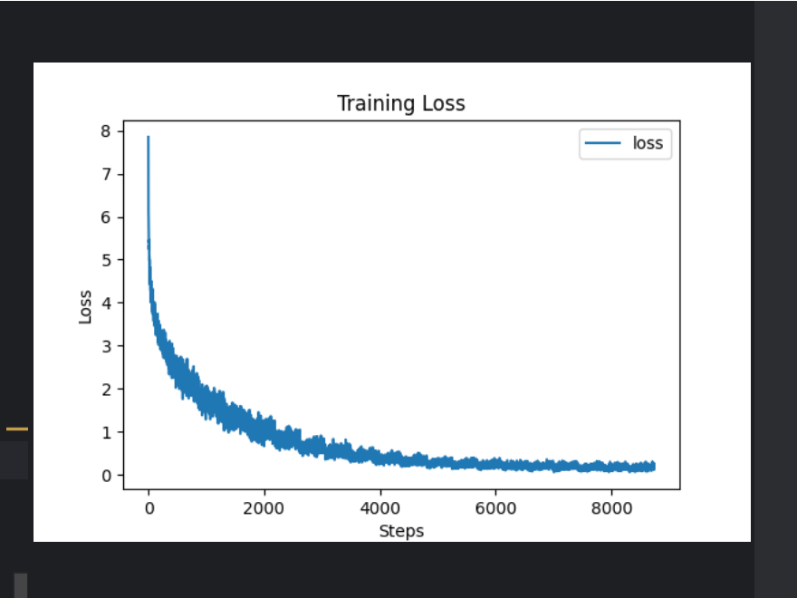

##  Attention is all you need
Simple Transformer Implemented by Pytorch.
基于谷歌原论文的transformer实现，在舍弃了数据预处理和工程优化等内容，旨在帮助初学者快速复现并理解transformer和pytorch的内容架构，同时聚焦于自己复现时遇到的各种问题，尽量详细的做到适合中国宝宝体质的无障碍理解。

PS:感谢[ngolin](https://github.com/ngolin)提供了框架和数据集，本项目使用的数据来自于[AttentionIsAllYouNeed](https://github.com/ngolin/AttentionIsAllYouNeed)

## 快速开始
配置环境
```bash
    pip install -r requirements.txt
```
快速开始
  利用训练好的 best_model.pt进行测试
```bash
    $ python test.py
```
## 文件说明
main.py：训练代码
model.py：模型结构与具体实现
best_model.pt:训练过程中得到的最好的模型
test.py 实验模型训练效果（中译英）
## 实验结果

## 参考资料
[论文原文](https://arxiv.org/abs/1706.03762)
[论文精讲](https://www.youtube.com/watch?v=nzqlFIcCSWQ)
[AttentionIsAllYouNeed](https://github.com/ngolin/AttentionIsAllYouNeed)


